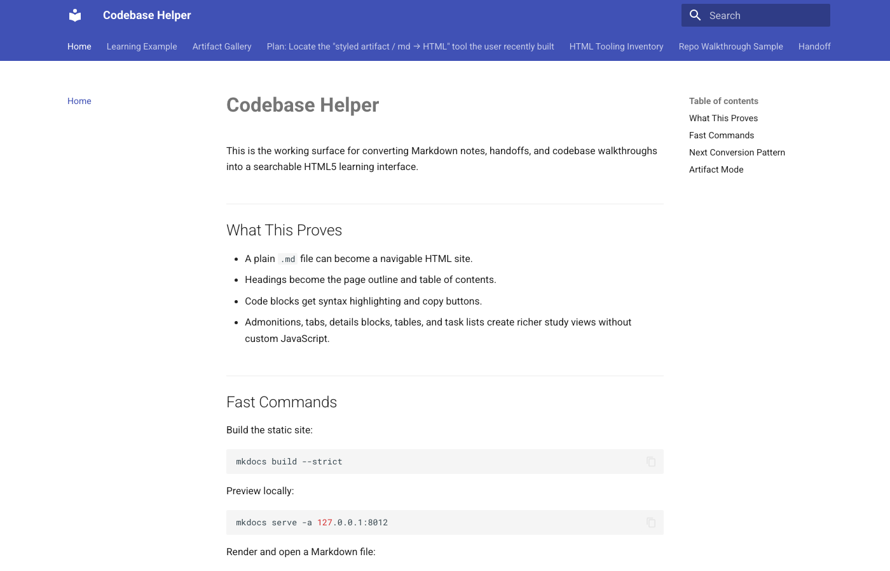
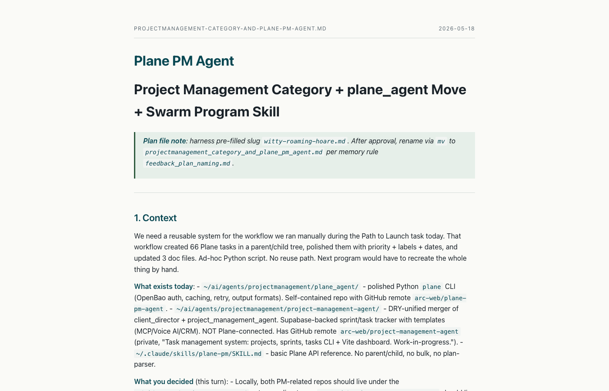
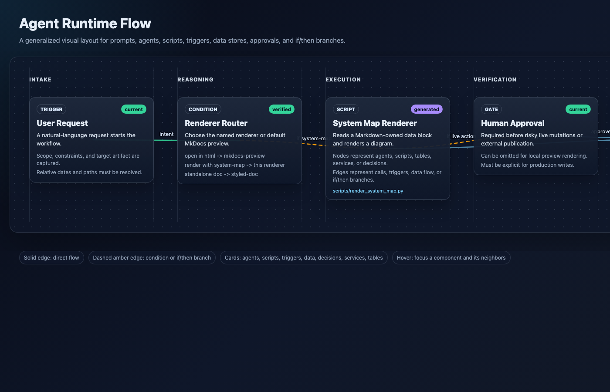
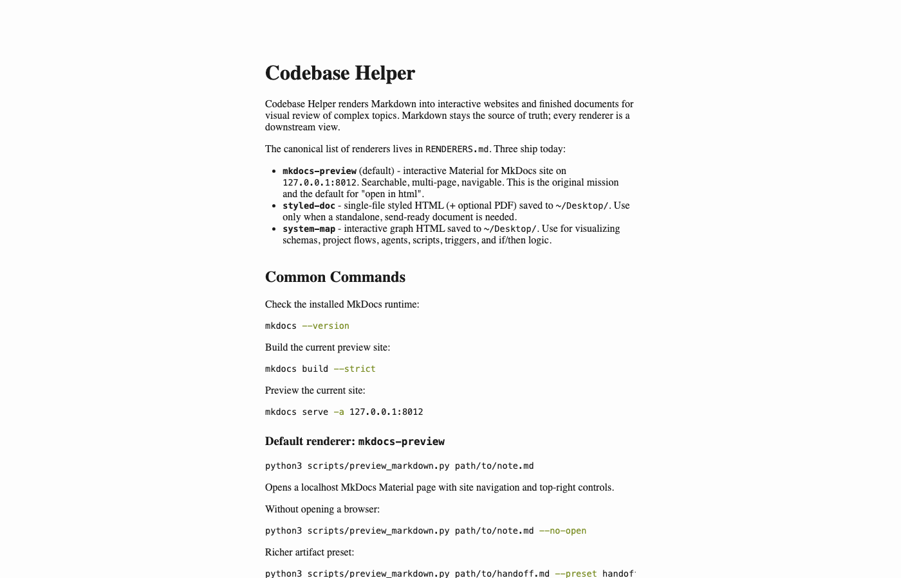

# Codebase Helper

> "We need a way to visualize all of the work of the agents and we just
> can't consume it fast enough through paragraphs of text."

Codebase Helper turns Markdown into shapes a human can actually read:
searchable sites, finished docs, animated decks, system maps, knowledge
graphs. The source of truth stays Markdown. Every renderer is a
downstream view.

## The problem

Agents produce walls of text. Plans, summaries, handoffs, audits. You
read 10-20% of it, skim the rest, and the parts you skipped quietly
start perpetuating bugs - "dual hallucination", where the agent is
confidently wrong and you're confidently not paying attention. It shows
up most in plan mode: the plan sounds fine if you read fast, but the
nuance that breaks it lives in the part you scrolled past.

The fix isn't more text. It's the right shape for the work:

- A decision tree wants a graph.
- A status update wants a slide.
- A spec wants a navigable site.
- A schema wants a map.

Codebase Helper is the toolkit that turns one Markdown file into any of
those, on demand, locally, in seconds. No paragraphs you'll skip.

## Renderers

The canonical list is in [RENDERERS.md](RENDERERS.md). Six ship today.

### mkdocs-preview - searchable site

Default renderer. Material for MkDocs themed local site at
`127.0.0.1:8012`. Best for multi-page topics where you need search and
nav.



```bash
python3 scripts/preview_markdown.py path/to/note.md
```

### styled-doc - finished single-file HTML

Self-contained styled HTML (with optional PDF) saved to Desktop. Use
when the doc is the deliverable: a brief, a proposal, a handoff.



```bash
python3 scripts/render_styled.py path/to/doc.md --title "Plane PM Agent"
```

### system-map - visual graph for flows and schemas

Interactive lane/card layout for agents, scripts, triggers, conditions,
and if/then logic. Reads a fenced `system-map` JSON block from the
Markdown.



```bash
python3 scripts/render_system_map.py docs/agent-system-map-sample.md
```

### pandoc - plain portable HTML

Generic one-shot Markdown to standalone HTML via pandoc with embedded
resources. No framework, no chrome - a single portable file.



```bash
python3 scripts/render_pandoc.py path/to/doc.md
```

### deck - animated browser slideshow

Wraps [gsap-deck](https://github.com/arc-web/gsap-deck). Reads a fenced
`json` block from the Markdown (or builds a stub from H1/H2 headings)
and renders an animated HTML slide deck.


```bash
python3 scripts/render_deck.py path/to/talk.md
```

### graphify - interactive knowledge graph

Wraps the graphify CLI. Extracts entities + relationships across docs
(or a whole codebase), clusters communities, and emits a navigable HTML
graph.


```bash
python3 scripts/render_graphify.py path/to/doc.md
python3 scripts/render_graphify.py path/to/docs-dir/
```

## Default behavior

When the user says "open in html" with no other qualifier, the default
is `mkdocs-preview`. That is the original mission: interactive
websites for visual review of complex topics.

## Why this exists

Plain text scales for the writer. It does not scale for the reader.
Codebase Helper exists so the reader can pick a shape that compresses
the wall of text into something the eye reads in seconds instead of
minutes - graph, map, deck, doc. Pick the one that matches the
decision you have to make.

## Adding a new renderer

See the contract in [RENDERERS.md](RENDERERS.md). A new renderer:

- Takes a Markdown path as its first positional argument.
- Defaults output to `~/Desktop/`.
- Supports `--no-open`.
- Never writes back into the user's source file.
- Adds a row to RENDERERS.md.

One renderer = one script under `scripts/`. Shared CSS lives in
`assets/`.
